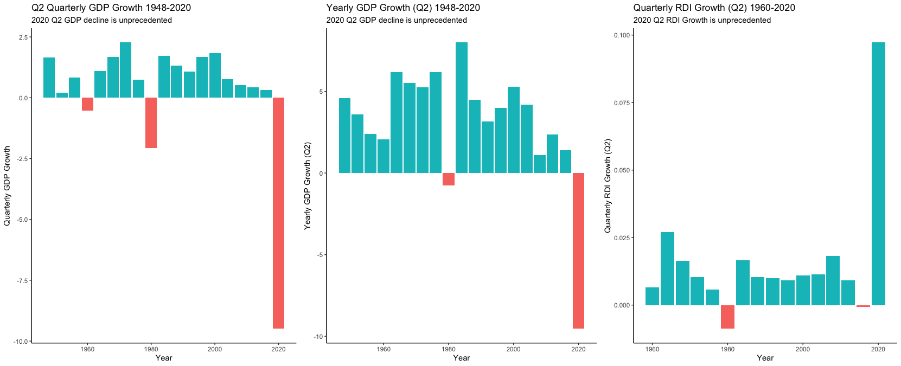

## Introduction

Perhaps one of the most essential questions to predicting elections is "how does a voter make their decision?" Decades of research has tried to answer this question and come up with many theories. One of the most prominent of these theories, introduced by V.O. Key in 1966, is retrospective voting, or voting in response to an incumbent’s job performance [(Achen and Bartels 2017)](https://press.princeton.edu/books/hardcover/9780691169446/democracy-for-realists). In other words, rewarding incumbents who do well and punishing those who do not. 

Following the logic that people vote based on their perception of an incumbent’s performance, we can predict the election by focusing on metrics of performance. This blog will focus on the economy as a metric of incumbent success and present a prediction model using economic data.
  
## Building the Model

  The health of the economy can be measured by many different metrics. I ran linear regressions on five national economic indicators (quarterly GDP growth, yearly GDP growth, the national unemployment rate, the stock market close, and growth in Real Disposable Income (RDI)) as predictors of the incumbent popular vote. All data is taken from the second quarter of election years, or 14th quarter of the incumbent’s term. I chose this time frame based on the theory of voter myopia, which states that voters tend to only take conditions from the election year, and even the  most recent six months leading up to the election, into consideration when assessing an incumbent’s performance [(Achen and Bartels 2017)](https://press.princeton.edu/books/hardcover/9780691169446/democracy-for-realists). 
  
  ** On a side note, voter myopia is particularly interesting from a psychological perspective, as voters often intend to take into account an entire presidential term in their evaluations, but still disproportionately value data from the election year when assessing economic performance [(Healy and Lenz 2014)](https://onlinelibrary-wiley-com.ezp-prod1.hul.harvard.edu/doi/pdfdirect/10.1111/ajps.12053). **
  
  Going back to analysis, summary statistics of the linear regressions are shown in the table below.  
  
  
  
##### Analysis

> - Quarterly GDP growth shows the strongest correlation (.57) and R Squared (.326) values, meaning that the model accounts for the most amount of variance compared to models with other economic indicators 
> - Quarterly GDP growth also shows the lowest Mean Squared Error(4.2) and lowest mean out-of-sample cross validation testing error (1.74)
> - Yearly GDP growth also appears to be a decent predictor of the popular vote, however, all of its metrics are slightly weaker than Quarterly GDP growth
> - Quarterly RDI growth appears to be the third best predictor of the popular vote, with all metrics weaker than both Quarterly and Yearly GDP growth
> - Both Stock close and Unemployment do not display predictive power, with R Squared values near 0 and MSE values about .8 to .9 higher than GDP predictors 

These regression results suggest that Quarterly GDP growth is the best predictor of the popular vote compared to other economic indicators and that Yearly GDP growth and RDI growth also have predictive power. 

### Prediction

The graphics below compare the predictions of the quarterly GDP, yearly GDP, and RDI models. 

##### Analysis

> - All three models predict the 2020 popular vote at vastly different places, with the quarterly GDP model predicting Trump winning 21% of the popular vote, the yearly GDP model predicting Trump winning 34% of the popular vote, and the RDI model predicting Trump winning 80% of the popular vote 
> - The prediction intervals from all the models are quite large, with the quarterly GDP model ranging from -4% to 46%,  
the yearly GDP model ranging from 16% to 51%, and the RDI model ranging from 49% to 104%
> - These predictions are probelmatic, as they are extreme in both their predictions and prediction intervals (a popular vote obviously cannot be negative or positive) 

### The Problem: Extrapolation
The problem with these models likely comes from extrapolation – the case when the prediction data is outside of the range of the data used to build the model. One of the consequences of extrapolation is extreme, and often unreliable, prediction values and verge large prediction intervals, which we saw in the predictions above. 
In the case of 2020, the corona virus pandemic triggered a world wide economic shock, leading to incredible volatily and unprecedented economic movement. This volatility manifested itself in all of the economic metrics used in building our predictive models. 
The graphic below visualises this extremity. 

##### Analysis

> - 2020 Q2 Quarterly GDP growth was -9.49%, a value much lower than any other Q2 quarterly growth in the data set. The next lowest growth was in 1980 (-2.06%)
> - Similar to 2020 Q2 Quarterly GDP Growth, 2020 Q2 Yearly GDP Growth sat at -9.54%. The next lowest Q2 GDP yearly growth was in 1980 (-.775%)
> - Quarterly RDI Growth is extreme in the opposite direction compared to GDP growth. 2020 Q2 Quarterly RDI Growth (.0972%) is much higher than any of the RDI growths in the data set. The next highest growth is from 1964 (.027%)

### Conclusion
In conclusion, the volatility and unprecedented nature of the 2020 economy brought on by the Covid-19 pandemic makes economic metrics not ideal in predicting the 2020 election. I believe it would be better to focus on different metrics to more accurately predict this year's presidential race. 

