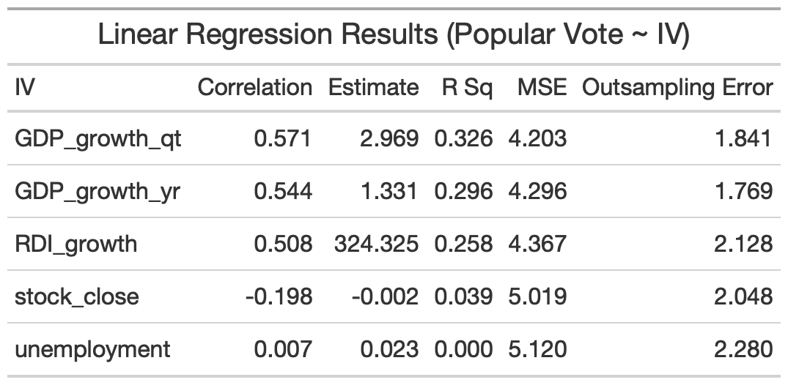

## Introduction

  Perhaps one of the most essential questions to predicting elections is how does a voter make their decision? Decades of research has tried to answer this question and come up with many theories. One of the most prominent of these theories, introduced by V.O. Key in 1966, is retrospective voting, or voting in response to an incumbent’s job performance (Achen and Bartels 2017). In other words, rewarding incumbents who do well and punishing those who do not. 
	Following the logic that people vote based on their perception of an incumbent’s performance, we can predict the election by focusing on metrics of performance. This blog will focus on the economy as a metric of incumbent success and present a prediction model using economic data.
  
## Building the Model

  The health of the economy can be measured by many different metrics. I ran linear regressions on five national economic indicators (quarterly GDP growth, yearly GDP growth, the national unemployment rate, the stock market close, and growth in Real Disposable Income (RDI)) as predictors of the incumbent popular vote. All data is taken from the second quarter of election years, or 14th quarter of the incumbent’s term. I chose this time frame based on the theory of voter myopia, which states that voters tend to only take conditions from the election year, and even the  most recent six months leading up to the election, into consideration when assessing an incumbent’s performance(Achen and Bartels 2017). 
  
  ** On a side note, voter myopia is particularly interesting from a psychological perspective, as voters often intend to take into account an entire presidential term in their evaluations, but still disproportionately value data from the election year when assessing economic performance (Healy and Lenz 2014). **
  
  Going back to analysis, summary statistics of the linear regressions are shown in the table below.  
  
  
  
#### Analysis

> - Quarterly GDP growth shows the strongest correlation (.57) and R2 (.326) values, meaning that the model accounts for the most amount of variance compared to models with other economic indicators 
> - Quarterly GDP growth also shows the lowest Mean Squared Error(4.2) and lowest mean out-of-sample cross validation testing error (1.74)
> - Yearly GDP growth also appears to be a decent predictor of the popular vote, however, all of its metrics are slightly weaker than Quarterly GDP growth
> - RDI growth appears to be the third best predictor of the popular vote, with all metrics weaker than both Quarterly and Yearly GDP growth
> - Both stock close and unemployment do not display predictive power, with R2 values close to 0 and MSE values about .8 to .9 higher than GDP predictors 
