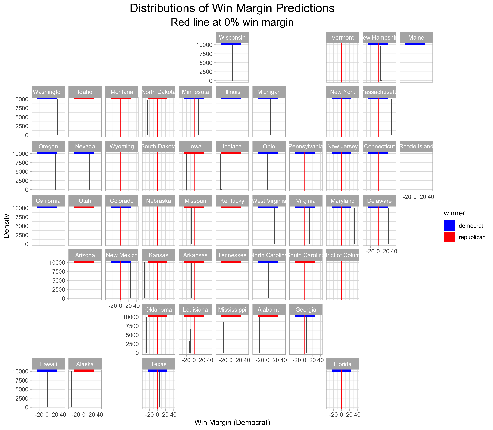

# How Ad Spending could Change the Election
October 10,2020

## Introduction

This week's blog post will look at how Trump could leverage spending on media ads to gain an edge in the election.
First, I will discuss some changes in the form of the poll model I have used in the past few weeks. Next, I will
use the updated model to simulate the 2020 election. Finally, I will discuss the potential affects of ad spending on vote share in a few key swing states (Arizona, Florida, and Georgia). 

## Updating the Poll Model

This week's model will be a binomial logit model, not a linear regression. I made this change
because probabalistic models, like the binomial model, restrict the boundaries of prediction from 0 to 100, which more accurately represents vote share possibilities (prior models had 
prediction intervals reach below 0% or above 100%). The model works by predicting the probability of each voter in the eligible voter population in each state to turn out for a candidate. The independent variable is still the average poll support in each state, however, I have updated those numbers to reflect polls five weeks out from the election, not six. 

I ran a binomial logistic regression for each state with historical polling data. Using these models, I ran 10,000 simulations of the 2020 election based off of the current poll averages form [538](https://projects.fivethirtyeight.com/polls/president-general/). The simulations show the predicted win margins in each state based off of the predicted draw of the voter eligible population for Biden and Trump. The map below shows the distributions of the results from these simulations. 

#### Analysis
> - Taking the means of these distributions as the predicted win margin, the model
predicts that Biden wll win with 400 electoral votes and Trump will lose will 138 electoral votes
> - It is worth being skeptical about some of these results, however, as some states seem
unrealistic
> - For example, the model has Trump winning Arizona by double digits when my past models, as
well as other poll based [models](https://projects.fivethirtyeight.com/polls/president-general/arizona/) have Biden winning Arizona
> - This model also has Biden winning Texas, where all my past models have Trump winning Texas, and 
most professional [models](https://projects.economist.com/us-2020-forecast/president/texas) predict that Trump will most likely win in Texas
> - The model also predicts that Biden will win West Virginia when West Virginia will almost
certainly vote for [Trump](https://projects.economist.com/us-2020-forecast/president/west-virginia)
> - The model predicts slim margins in swing states such as Florida, Georgia, Ohio, Wisconsin, New Hampshire, and Michigan
> - The model predicts Biden's win to be more decisive than [last week's Covid-19 model](inc.md). 

*Note:* There is not poll data available to build models for a few states (Vermont, Wyoming, South Dakota, Rhode Island, Nebraska, and DC). However, as was the case in prior blog posts, I believe it is a safe bet to use prior election results in these states as a proxy for 2020. 

## Looking at Key Swing States

The graphic below shows the distributions for North Carolina, Florida, and Wisconsin. 

#### Analysis
> - The model estimates Wisconsin's win margin at just below 4.5%
> - The model estimates Florida's win margin at just below 3%
> - The model estimates North Carolina's win margin at just above 2%

## Shifting the Win Margin with Ad Spending

According to 2011 research by Alan Gerber and 2007 research done by Gregory Huber,
political advertising can have persuasive effects on voters. Specifically, both 
of these studies found that investment in Gross Point Rating (a marketing term
that referes to the number of airings of an ad multipleid by the percent of reachable audience), leads to an increase in vote share. Specifically, Gerber estimated that 
an addition of 1,000 GRPs buys a 5 point shift in vote share (plus or minus 1.5%), and
Huber estimated that an addition of 1,000 GRPs buys a 7.5 point shift in vote share (plus
or minus 2.5%). 

Using these estimates, and knowing that 1 GRP costs about $300, we can estimate 
how much Trump would have to spend to win these swing states. 

**Wisconsin:** Looking at the distribution above, Trump would have to gain about about 6.5% vote share to have about a 2% win margin. According to Gerber, this translates into Trump needing about 1,300 more GRPs than Biden going into the election. According to Huber, this translates into Trump needing about 866 more GRPs than Biden going into the election. This equates to 
Trump having to spend $390,000 or $259,800 more than Biden. 

**Florida:** Looking at the distribution above, Trump would have to gain about about 5% vote share to have about a 2% win margin. According to Gerber, this translates into Trump
needing about 1,000 more GRPs than Biden going into the election. According to Huber, this translates into Trump needing about 666 more GRPs than Biden going into the election. This equates to Trump having to spend $300,000 or $199,800 more than Biden. 

**North Carolina:** Looking at the distribution above, Trump would have to gain about about 4%
to have about a 2% win margin. According to Gerber, this translates into Trump needing about 800 more GRPs than Biden going into the election. According to Huber, this translates into about Trump needing about 800 GRPs more GRPs than Biden going into the election. 

### What does the current spending data look like?
As of now, Biden is outspending Trump in both Florida and Wisconsin, meaning that it would be potentially difficult for Trump to spend as much as he needs to in order to shift the vote in his direction. 

 
