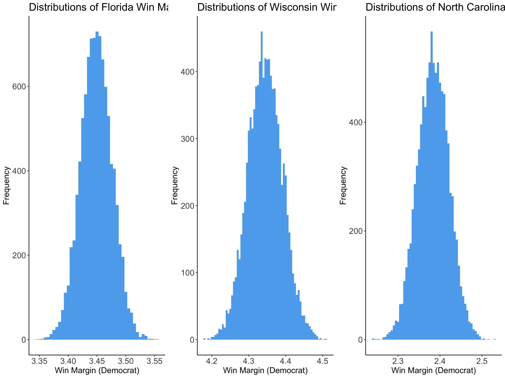

# How Ad Spending could Change the Election
October 10,2020

## Introduction

This week's blog post will look at how Trump could leverage spending on media ads to gain an edge in the election.
First, I will discuss some changes in the form of the poll model I have used in the past few weeks. Next, I will
use the updated model to simulate the 2020 election. Finally, I will discuss the potential affects of ad spending on vote share in a few key swing states (Arizona, Florida, and Georgia). 

## Updating the Poll Model

This week's model will be a binomial logit model, not a linear regression. I made this change
because probabalistic models, like the binomial model, restrict the boundaries of prediction from 0 to 100, which more accurately represents vote share possibilities (prior models had 
prediction intervals reach below 0% or above 100%). The model works by predicting the probability of each voter in the eligible voter population in each state to turn out for a candidate. The independent variable is still the average poll support in each state, however, I have updated those numbers to reflect polls five weeks out from the election, not six. 

I ran a binomial logistic regression for each state with historical polling data. Using these models, I ran 10,000 simulations of the 2020 election based off of the current poll averages form [538](https://projects.fivethirtyeight.com/polls/president-general/). The simulations show the predicted win margins in each state based off of the predicted draw of the voter eligible population for Biden and Trump. The map below shows the distributions of the results from these simulations. 

#### Analysis
> - Taking the means of these distributions as the predicted win margin, the model
predicts that Biden wll win with 400 electoral votes and Trump will lose will 138 electoral votes
> - The difference between this model's results and the linear model's results is Texas
> - However, I believe that according to recent polls Texas is more likely to go Republican
> - The model predicts slim margins in swing states such as Iowa, Florida, Georgia, Ohio, Wisconsin, and others
> - The model predicts Biden's win to be more decisive than [last week's Covid-19 model](mod). 

## Looking at Key Swing States

The graphic below shows the distributions for Nortth Carolina, Florida, and Arizona. 

#### Analysis
> - The model estimates Arizona's win margin at just over 4%
> - The model estimates Florida's win margin at just below 3%
> - The model estimates North Carolina's win margin at just above 2%

## Shifting the Win Margin with Ad Spending

 
