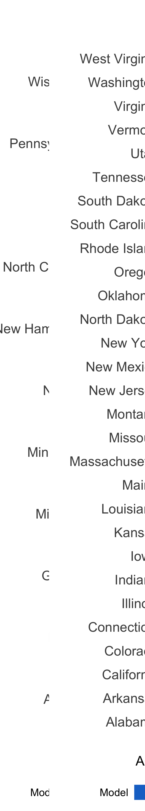
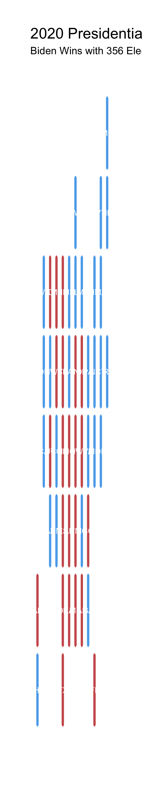

# Do Demographic Changes Affect Election Results?

October 17, 2020

### Introduction

This week's blog post will focus on the inclusion of demographics in my predictive model. I will also discuss the usage of a new pooled 
model that includes data from every state as opposed to usage of state models that include data only from a particular state. 

### Incorporating Demographics into my Model

There are many reasons why demographics could be important in predicting elections. Certain demographic groups, such as Hispanics, Women, Asians,
and a few others predicably vote democrat. Other demographic groups, such as Whites, more often vote republican. As such, a change in the proportions 
of demographic groups in an electorate can have an impact on election results. If we know the historical effect of each of these groups on election
outcomes, we can predict how the demographic changes in 2020 could influence the election. 

Unfortunately, I only have access to historical demographics data related to the Democrat popular vote and not historical Republican demographic data. Therefore, I could only build a demographics model for the Democrat vote share and had to rely on a polling model for the Republican vote share. 

The table below shows the results of three different pooled models. 

#### Discussion

> - The first model includes polls taken three weeks out from the election for all states and predicts the Democrat popular vote
> - The second model includes the same polls and demographic changes within states and predicts the Democrat popular vote
> - The third model includes polls taken three weeks out from the election for all states and predicts the Republican vote share
> - The adjusted R^2 values are high across all the models
> - This is most likely because I am using polling data from three weeks from the election, and, and discussed in previous [posts](polls.md), polls become increasingly predictive over time
> - Between the two Democrat models, the R^2 is slightly better in model #2, so I will continue to use the demographics model to predict the Democrat popular vote

### Model Selection: State vs. Pooled models 

Now that I've built a pooled model that incorporates demographics, it is worth checking how a pooled model performs vs. a model built off of individual state data. I compared the predictive abilities of these two different types of models using leave one out classification accuracy analysis. I ran this analysis for every state-year observation in the data. The graphic below shows the proportion of elections each model correctly predicted in each state. 

**Note:** The Republican popular vote predictions comes from either a pooled or individual state model that **does not include** demographic data, as no data is available. The Democrat popular vote predictions from from either a pooled individual model that **includes both** democraphic data and polling data. 

#### Discussion

> - The pooled and state models correctly predict the same proportion of elections in most states with some exceptions
> - The pooled model outperforms the state models in the battleground states of Ohio, Michigan, and Georgia 
> - The state model outperforms in Arizona

### Predicting 2020 with an Ensemble Model

I predicted the results of the 2020 election using a weighted ensemble of both indiviudal state models and the pooled models. 
I chose the weightings according to each model's out of sample model performanc (see above). As the pooled model incorporates
much more data than each individual state model, I generally gave the pooled model more weight. I assigned the weights as follows:
 > - If the pooled model and state model performed equally well, I assigned the pooled model a weight of .8 and the state model a weight of .2
 > - If the pooled model outperforms the state model, I assigned the pooled model a weight of 1 and the state model a weight of 0
 > - If the pooled model underperformed the state model, I assigned the pooled model a weight of .5 and the state model a weight of .5
 
 **Note:** I did not have adequate data to use the demographic model in about 10 states (Texas, Maryland, Kentucky, Mississippi, Nebraska, Idaho, Hawaii, Wyoming, Delaware, Alaska, and DC). In those cases, I used a poll only model. 
 
 #### Results
 
 The map below shows this week's prediction results. 
 
 
 
 #### Discussion
 
  > - Biden wins with 356 electoral votes and Trump loses with 182 electoral votes
  > - Biden wins key swing states of Arizona, Georgia, Florida, North Carolina, Wisconsin,
  Pennsylvania, and Iowa
  > - Biden wins Iowa by a tight .25% win margin and Georgia by a tight .34% win margin
  
#### Sensitivity Analysis
 
I changed the weightings of the pooled and state models to see if that changed my prediction
  > - Giving the state models more weight resulted in Biden winning with 364 votes (see map below)
  > - Giving the pooled model more weight results in Biden winning with 356 votes (the same as the initial prediction)
  
 
 
 > - The difference between these two predictions in Louisiana, suggesting that the individual state model for Louisiana is not very good. It is valuable to use pooled models for states such as Louisiana, which will [almost certainly go Republican](https://projects.economist.com/us-2020-forecast/president/louisiana) despite the individual state model's prediction. 
 
### Conclusion
 
Introducing demographics into a model leaves room for prediction regarding voter turnout for different demographic groups. In the future, it would be interesting to simulate how changes in different demographic groups' turnouts will affect the election. For example, what would happen if female voters turned out in a greater number than the historical trend? What would happen if Hispanic voters did?

On a concluding note, the use of a pooled model is helpful for predicting the results in states that don't have a lot of data (such as Louisiana) and I will most likely continue to use this type of weighted ensemble in my final prediction. 
