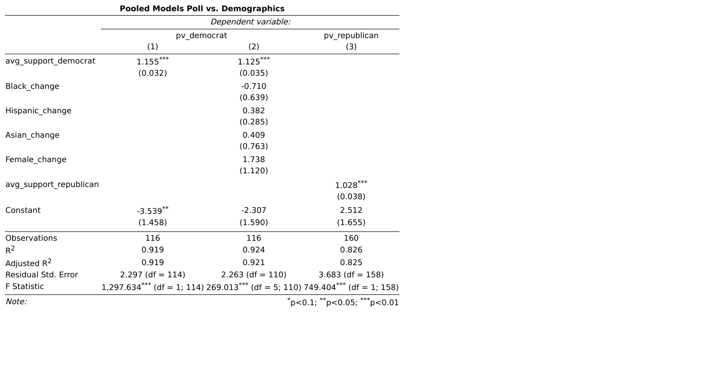

# Do Demographic Changes Affect Election Results?

October 17, 2020

### Introduction

This week's blog post will focus on the inclusion of demographics into my predictive model. I will also discuss the usage of a new pooled 
model that includes data from every state as opposed to usage of state models that include data only from a particular state. 

### Incorporating Demographics into my Model

There are many reasons why demographics could be important in predicting elections. Certain demographic groups, such as Hispanics, Women, Asians,
and a few others predicably vote democrat. Other demographic groups, such as Whites, more often vote republican. As such, a change in the proportions 
of demographic groups in an electorate can have an impact on election results. If we know the historical effect of each of these groups on election
outcomes, we can predict how the demographic changes in 2020 could influence the election. 

Unfortunately, I only have access to historical democratic demographics data and not historical republican demographic data. Therefore, I could
only build a demographics model for the democrat vote share and had to rely on a polling model for the republican vote share. 

The table below shows the results of three different pooled models. 

##### Discussion

> - The first model includes polls taken three weeks out from the election for all states and predicts the Democrat popular vote
> - The second model includes the same polls and demographic changes within states and predicts the Democrat popular vote
> - The third model includes polls taken three weeks out from the election for all states and predicts the Republican vote share
> - The adjusted R^2 values are high across all the models
> - This is most likely because I am using polling data from three weeks from the election, and, and discussed in previous [posts](polls.md), polls become increasingly predictive over time
> - Between the two Democrat models, the R^2 is slightly better in model #2, so I will continue to use the demographics model to predict the Democrat popular vote

### Model Selection: State vs. Pooled models 

Now that I've built a pooled model that incorporates demographics, it is worth checking how a pooled model performs vs. a model built off of individual state data. I compared the predictive abilities of these two different types of models using leave one out classification accuracy analysis. I ran this analysis for every state-year observation in the data. The graphic below shows the proportion of elections each model correctly predicted in each state. 
