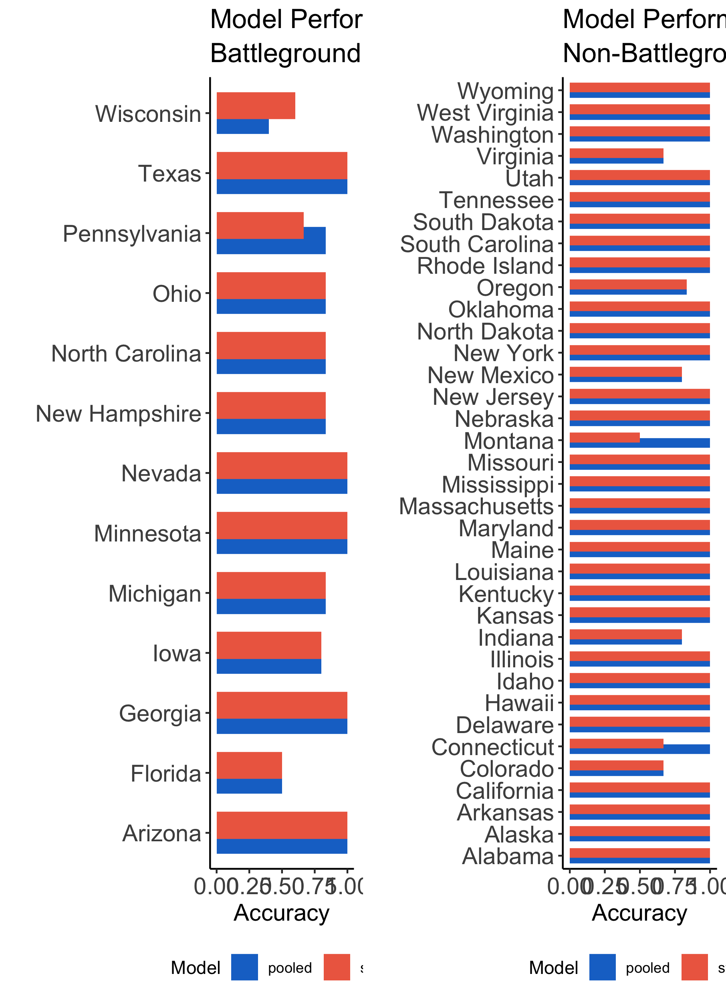

### Model Description Overview: 

My final prediction model is a two sided ensemble model that uses both recent poll data and demographics data. One side of the model predicts the Democrat popular vote share in every state and the other side predicts the Republic popular vote share in every state. 

### Ensemble Part 1: Pooled Models

The first component of my ensemble is a pooled model built from data across states. The Democrat model regresses popular vote on the average poll support one week out from the election and various demographic variables (see below for list). The Republican model regresses popular vote on just the average poll support one week out from the election.

I chose to only use polls one week away from the election, because historically polls are more accurate the closer they are to the [election](https://www.semanticscholar.org/paper/Election-forecasting%3A-Too-far-out-Jennings-Lewis-Beck/7d0621cd3f984483652caf09e7764c88233948d7).

I chose to **not include** fundamentals economic data because of the unprecedented nature of 2020, as I discussed in a previous [blog post](econ.md). 

See the table below for regression results.

#### Discussion:

> - The Republiican model shows that there is on average a small positive relationship between polls and popular vote, specifically that as average poll support increases by 1%, actual popular vote share increases by .041%
> - The Adjusted R Squared value is very high (.901)
> - The Democrat model shows that there is on average a positive relationship between polls and popular vote, specifically that as poll support increases by one percent actual popular vote share increases by .09 %. 
> - The Democrat model also estimates that an increase in the proportion of the Black, Hispanic, Female, or White population who vote lead to various increases in the Democrat vote share (see table for specific values). The model shows that an increase in the proportion of the Asian, people 20 to 30, people 30 to 45, or people 45 to 60 population who vote lead to various decreases in the Democrat vote share. 
> - The Adjusted R Squared for the Democrat model is very high (.927), slightly better than the Republican model

### Ensemble Part 2: State Models

The second component of my ensemble model is an idiosyncratic state model. Both the Republican and the Democrat model only use poll data, as there are relatively few observations to build a model off of for each state. See the histogram below for the Adjusted R Squared Values for state models.

#### Discussion:
> - The Adjusted R Squared is generally much higher in the pooled model
> - Some of the Adjusted R Squared values are negative (for Montana, Delaware, and South Carolina republican models, for Mississippi and Kansas Democrat Models), suggesting that it would be better to predict these states with the pooled model

### Ensemble Part 3: Weighting the Model 

I determined the weights of my model by cross validation analysis results. In the cross validation process, I removed a state-year observation from both the pooled and state model data set and predicted the results of that state-year election. The cross validation value equals the proportion of state-years the pooled or state model correctly predicted. The graphic below shows these values. 

#### Discussion:

> - The state and the pooled model for the most part predicted elections with the same level of accuracy
> - The pooled model outperformed the state model in Pennsylvania
> - The state model outperformed the pooled model in Wisconsin
> - The pooled model outperformed the state model in Montana and Connecticut

In general, I decided to give the pooled model more weight because of its in-sample strength (see R Squared numbers above) and the fact that it incorporates many more data points than the state models. I determined the weights as follows:

> - If the pooled and state models performed equally well in the cross validation analysis, I gave the pooled model a weight of .8 and the state model a weight of .2
> - If the pooled model underperformed the state model, I assigned the pooled model a weight of .5 and the state model a weight of .5
> - If the pooled model outperformed the state model, I assigned the pooled model a weight of 1 and the state model a weight of 0
> - For the states with state models with negative Adj R Squared values, I gave the pooled model a weight of 1 and the state model a weight of 0

## Predicting 2020 with the Ensemble Model

To predict the 2020 election, I used the average poll support for either Trump or Biden a week out from the election from [538](https://projects.fivethirtyeight.com/polls/) as well as demographic change data for 2020 using the ensemble model from above. The model predicts that Biden will win the election with 356 electoral votes and Trump will lose with 182 electoral votes. See the Maps below for a winners map and win margin map. 
**Note:** The models predict popular vote share, *not* two party popular vote share, so the predictions may not add up to exactly 100% in each state

#### Discussion:
> - There are tight results in many battleground states
> - Biden wins Georgia by .4 points
> - Trump wins Texas by 1.82 points
> - Biden wins Iowa by .63 points
> - Biden wins North Carolina by 1.76 points
> - Biden wins Arizona by 2.3 points

### Uncertainty:
I simulated uncertainty in my model by taking advantage of bootstrapping. To find prediction intervals, I looked at the results of models built off of 300 bootstrapped samples. For each bootstrapped sample, I built a pooled and state model for every state. I then calculated a point prediction for each model using the same 2020 data as above and I also calculated the standard error of each model. For each model, I then took 1000 random samples from a normal distribution constructed with the aforementioned point prediction as the center and standard error as sigma. To get a prediction value, I combined the pooled and state model samples using the same weights as above. I saved each prediction value in a vector to create a distribution from which I could calculate prediction intervals. I calculated prediction intervals by taking the 5th and 95th percentile of the prediction value distributions. The graphic below shows these prediction intervals. 

#### Discussion:
> - There is a fair amount of uncertainty in many battleground states
> - Notably, the prediction intervals overlap in Texas, Pennsylvania, Ohio, North Carolina, Iowa, Georgia, Florida, and Arizona 
> - This uncertainty leads me to classify those states as toss up, or states where I can’t predict a winner with confidence (especially in Iowa and Georgia)

## Wrap-up and Concluding Thoughts

First and foremost, it is worth being wary of any model that relies so heavily on polls, as mine does, because polls can be drastically wrong, as seen in the [2016 election](https://www.nytimes.com/2017/05/31/upshot/a-2016-review-why-key-state-polls-were-wrong-about-trump.html). I think it is entirely possible that the problems seen in 2016[ haven’t been fixed](https://fivethirtyeight.com/features/what-pollsters-have-changed-since-2016-and-what-still-worries-them-about-2020/) for 2020 and, thus, may not be completely representative. However, I still believe it would be a mistake to include fundamental economic data in the model, because of aforementioned reasons. So, I stick with my conclusion that for 2020, polls are the best we got. The inclusion of demographic data also adds an important depth to the model. 

Second, although my model predicts Biden wins in a landslide, I think the election could be a lot closer if those battleground toss-up states go red. I think it is too close to predict a  winner with any certainty in Iowa and Georgia, and to a lesser extent in  North Carolina, Ohio, Arizona, Texas, and Florida. These are obviously states with significant amounts of electoral votes. 

Finally, I don’t expect the election results to be finalized on election night, especially in states with many mail-in ballots. As such, I believe people should be cautious of proclaiming a winner prematurely. 

