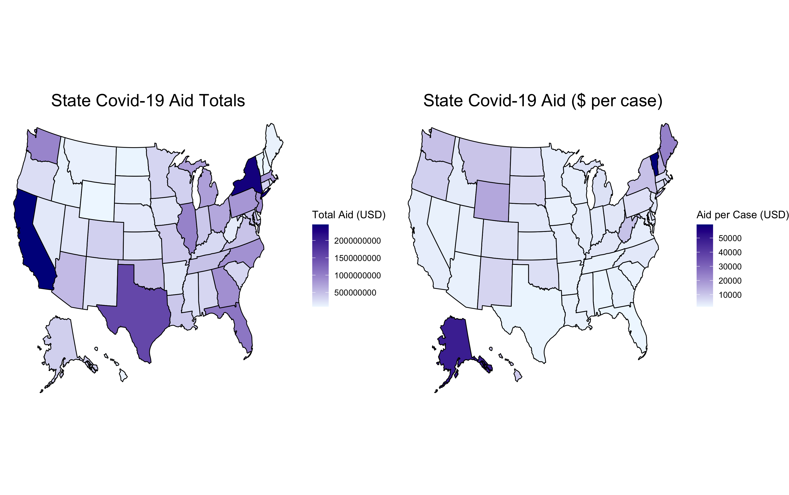
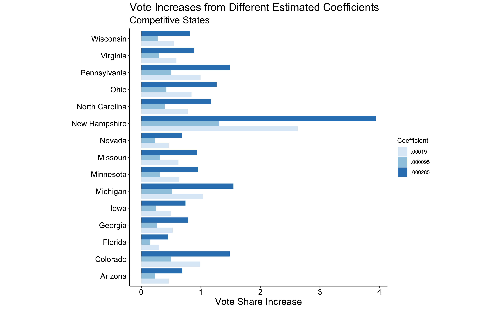

# Incumbency, Federal Spending, and Covid-19 Aid

### Introduction

Going back to the idea of retrospective voting explored in my [economy post](Econ.md), 
this week’s blog post will investigate how voters reward incumbents for allocating federal funds to
their home areas. I will summarise a state level model developed by Douglas Kriner and Andrew Reeves
in 2012 and then discuss how that model can be used to think about the impacts of Covid-19
aid on the 2020 election. 


### Kriner and Reeves Model

In their [2012 paper](https://www.jstor.org/stable/41495082?seq=1) "The Influence of Federal Spending on Presidential Elections," Kriner and Reeves demonstrate a positive relationship between an increase in 
federal spending at a state level and vote share for an incumbent president. Some of their 
key findings are as follows:

> - On average, for every percent increase in federal spending between years, there is an increase
in popular vote share for the incumbent
> - This relationship is much stronger in competitive states (defined as states where the loser's popular
vote share averaged to be >= 45% in the past three elections) than non-competive states
> - For competitive states their model calculated a .02 increase in popular vote share for every
1% increase in federal spending
> - For non-competitive states, this coefficient was .008
> - In line with this finding, incumbents typically direct more federal spending to swing states during
both election and non-election years

In summary, Kriner and Reeves' work demonstrates that when more money goes to states, thoses states tend to
vote more for the incumbent than they otherwise would have (especially in competitive states). Although 
Covid-19 aid is different than general federal spending, it is not too far of a stretch to apply the principles
of Kriner and Reeve's work to estimate the effect of pandemic spending on the election. 

### Covid-19 Aid

The maps below show the total and per-case Covid-19 federal aid for each state. I chose to include
the per-case numbers as it standardizes values across smaller and larger states to make them 
more comparable. 



As we can see, although some state received vastly more total Covid-19 aid, the numbers are much closer
on a per-case basis. For this reason, the rest of this blog post's analysis will use the aid per case
numbers. 

#### Competitive vs. Non-Competitive States

Per Kriner and Reeves' findings, I thought it was possible competitive states received more 
funding per case than non competitive states. However, after looking at the data, that doesn't 
appear to be the case. See the boxplot below for this comparison. 


*Note:* competitive states were determined by the same criteria as above (states where the loser's popular
vote share averaged to be >= 45% in the past three elections). For 2020, those states 
are Arizona, Colorado, Florida, Georgia, Iowa, Michigan, Minnesota, Missouri, Nevada, New Hampshire, North Carolina, Ohio, Pennsylvania, Virginia, and Wisconsin. 

In my opinion, the fact that competitive states have not received more aid per case is encouraging,
as it suggests that Trump didn't try to manipulate the election with pandemic aid. 

#### Estimating the Effect of Aid on Vote Share

Going off of Kriner and Reeves' model, I would expect that increased federal 
funding in the form of Covid-19 aid will have an effect on the election.

*Note:* Because there is no historical data to compare Covid-19 aid to, however, it is impossible to 
run a regression and mathematically calculate this predicted effect. Thus, the estimates
below only reflect my own reasoning and logic. 

#### Competitive State Coefficients

I considered three different estimated coefficeints for competitive states:
.000095, .00019, and .000285.
I calculated the base case coefficient (.0002) by assuming that the average amount of Covid-19 aid will result
in about a 1.5% vote share increase for Trump. The mean aid per case amongst all states = 7624.52.  Using the formula:
``` coefficient = 1.5/7624.52 ```
I calculated the base coefficeint to be **.00019**. I then calculated a coefficient about 50% less than that value
(**.000095**) and 50% more than that value (**.000285**). 

The graphic below visualises how these estimates translate into a voting bump for Trump. 



#### Non-Competitive State Coefficients

In Kriner and Reeves' model, the non-competitive state coefficient equalled 40% of the competitive state
coefficient. I followed these guildlines to calculate my estimates for the non-competitive state
coefficient. Using the formula:
``` non-competitive_coeff = .4 x competitive_coeff```
I calculated the base coefficient to be **.000076**, the more conservative coefficient to be **.0000038**,
and the less conservatiive coefficient to be **.00011**. 

#### Incorporating Covid-19 Effect into a Prediction

I incorporated these estimates into last week's [poll model](poll.md) to see how the different
estimates influence predicted election results. 


