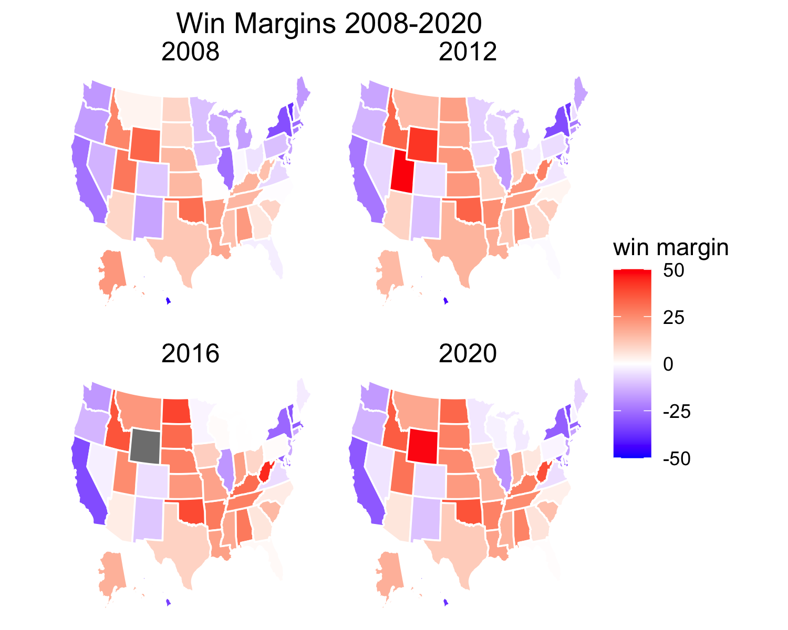

## Introduction

American presidential elections have always been a fascinating and contentious topic, perhaps nevermore so than in 2020. In this blog, I will build weekly models to predict the 2020  election. This introductory post will first present a basic predictive model derived from past election voting data and then discuss the concepts of "Purple America" and swing states. 

## Basic Predictive Model

Perhaps the most basic strategy to predict the 2020 election is to look at the results from previous elections. My model draws from the past three elections (2008, 2012, 2016). The graphic below displays the state-by-state victories for either the republican or democratic party from these three elections. A state appears red if the republican party candidate won the majority of votes or blue if the democratic party candidate did. 


My model calculates the predicted result of each state by taking a weighted average of the democratic and republican vote shares for each state for the past three elections. This equation is shown below.

```
Dem_vote_share_2020 <- (Dem_vote_share_2016 *.70) +
  (Dem_vote_share_2012 *.2) +
  (Dem_vote_share_2008 *.1)
Rep_vote_share_2020 <- (Rep_vote_share_2016 *.70) +
  (Rep_vote_share_2012 *.2) +
  (Rep_vote_share_2008 *.1)
```


I chose to weight the 2016 election by .7, as it is most similar to the 2020 election due to how recent it is as well as the consistency in republican candidates (Trump). I originally planned to weight the 2012 election by .3, but I decided it would be best to also consider the 2008 election, as it is the last election with a republican incumbent. Thus, I split the remaining weight between the 2012 and 2008 results by .2 and .1, respectively. 

*Note:* this data reflects the 2 party popular vote share as opposed to the overall vote share. This decision was made to counteract potential third party influences in the election, as significant third party influences are rare, even in  elections where both republican and democratic candidates are unpopular, such as in 2016 (Neville-Shepard 2017). 

### Results

The map below shows my state-by-state prediction.


My results show that Biden will win the election with 279 electoral votes (EV) and Trump with lose with  259 EV. My prediction differs from the 2016 election in a few key areas.

|              1. Wisconsin [10 EV] goes blue
|              2. Michigan [16 EV] goes blue
|              3. Pennsylvania [20 EV] goes blue


## Purple America and Swing States
However, these maps might be slightly misleading, as, in reality, states do not vote 100% red or 100% blue. In fact, win margins in states have shrunk dramatically over the past decades to the point where America can be seen as more purple than red and blue (Ansolabehere 2006). Thus, a perhaps more accurate representation of the three past elections as well as the model’s results are shown in the map below. 



These tight vote margins have important implications as they bring in the concept of swing states, or states that have the potential to go either red or blue and generally have very tight win margins. Going back to my prediction, the three states that changed from red to blue from 2016 to 2020, Pennsylvania, Wisconsin, and Michigan, showed the 2nd, 3rd, and 5th tightest vote margins in my forecast. Specifically:

|              Pennsyvania goes blue by 1.6%
|              Wisconsin goes blue by 2.2%
|              Michigan goes blue by 3.4%

All else constant, if even one of those states flipped red, Biden will not win the electoral college.

## Swing States

Some states have interesting histories as "perennial swing states" (Ansolabehere 2006). The graphic below shoes the movement in vote margins of five states I consider to be perennial swing states. I selected these states based on a method used by Ansolabehere, Rodden, and Snyder in "Purple America" (Ansolabehere 2006). This method classifies a swing state by taking the average of the democratic vote share for each state for the past four elections. A state is classified as a swing state if the average democratic vote share fell in between 48% and 51%. My analysis of vote shares from the 2004, 2008, 2012, and 2016 classified Florida, Iowa, North Carolina, Virginia, and Ohio as swing states. The graphic below shows the movement of the win margin within those states from 2004 to 2016. 


There a few interesting trends in this graph.
|              Florida and North Carolina have remained the "swingiest" of these five states
|              Virginia has become more democratic
|              Iowa and Ohio have become more republican
