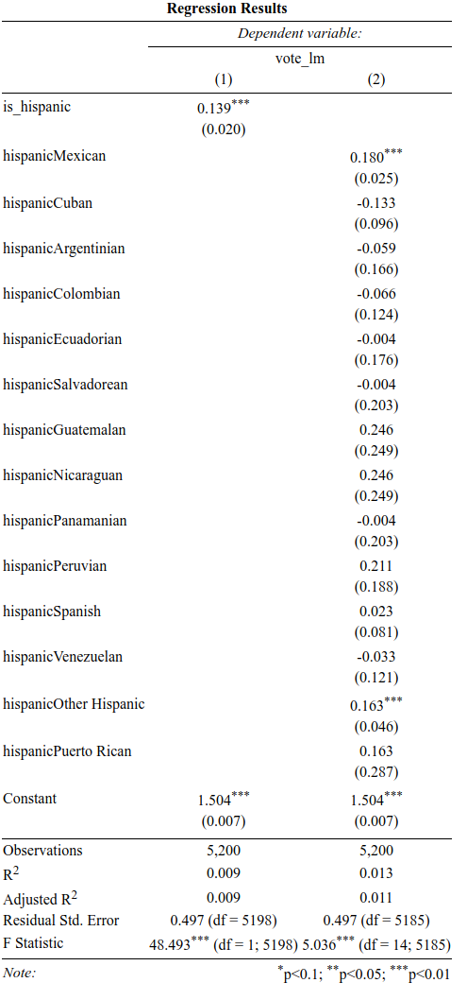
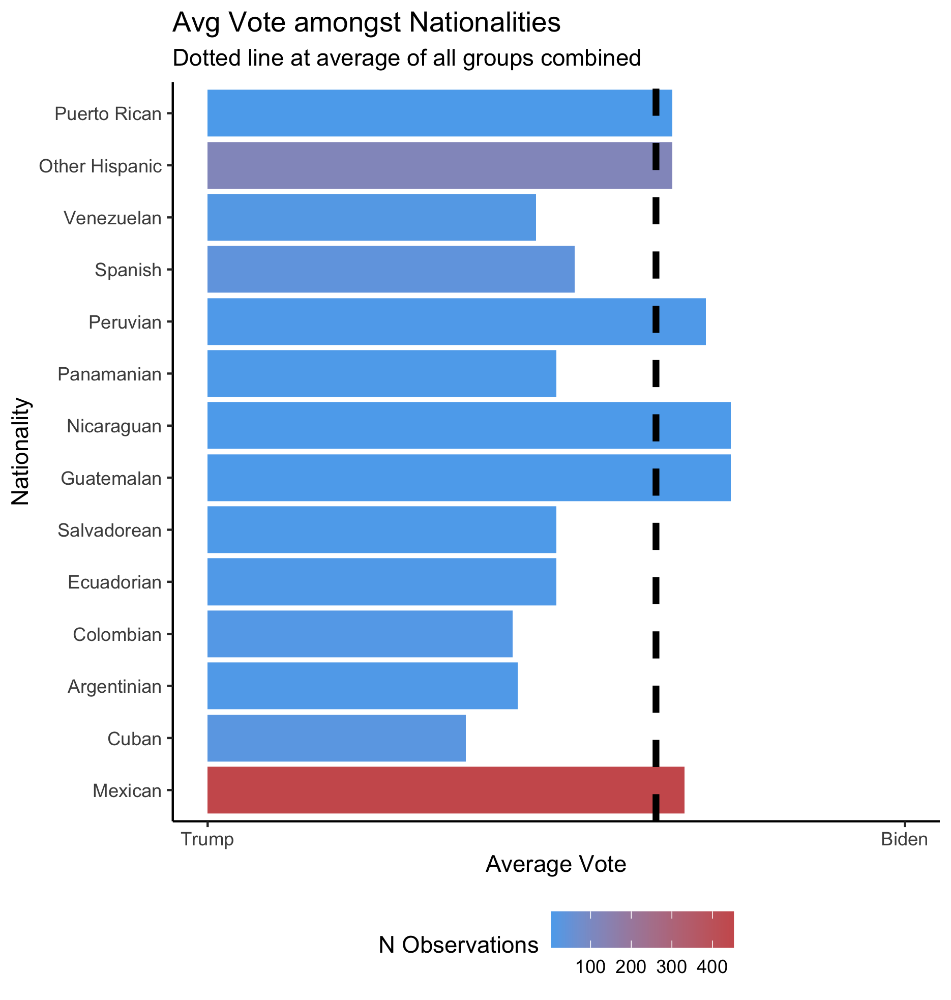

# The 2020 Election and the Latino Vote
December 6, 2020

Lindsey Greenhill

## Introduction
As 2020 comes to a close, it’s hard not to be excited about what the next year has to offer. Maybe life will return to pre-pandemic standards. Maybe I’ll get to go back to college. And, perhaps more relevantly to this blog, maybe I will be able to have a conversation with my relatives next Thanksgiving about a topic not related to Donald Trump or the election. However, before the new year arrives, I am going to offer one last blog post that is, as per usual, political. Specifically, I am going to explore one of the election’s most talked about media narratives: does the Latino vote actually exist?

## Background

Per the [Pew Research Center](https://www.pewresearch.org/fact-tank/2020/01/31/where-latinos-have-the-most-eligible-voters-in-the-2020-election/), Latinos made up just over 13% of the US eligible voter population in 2020. In 2016, the group accounted for just under 12%. In 2016, Trump won 28% of the Latino vote, and in 2020 he won 32%. In 2016, Clinton won about 66% of the Latino vote, and in 2020 Biden won the same. 

After the election, many media outlets claimed that the Latino vote had a major impact on the election. [Some say](https://www.washingtonpost.com/politics/2020/11/04/what-election-results-so-far-tell-us-about-latino-vote/) that the Latino vote is why Biden performed so well in Texas, Arizona, and Virginia. On the other hand, many also claim that the Latino vote is why Biden lost Florida. But how can that be that the Latino vote had such differing effects across states? 

Flashy headlines about this question appeared in publications across the political spectrum with an answer – **there is no unified Latino vote, and maybe there never was.**

> - See *Time Magazine's* November 10 [article](https://time.com/5907525/latino-vote-2020-election/) "Why It's a Mistake to Simplify the 'Latino Vote'"
> - See *The Washington Post's* November 4 [article](https://www.washingtonpost.com/politics/2020/11/04/what-election-results-so-far-tell-us-about-latino-vote/) "What the election results so far tell us about the Latino vote"
> - See *CNN's* November 9 [article](https://www.cnn.com/2020/11/09/politics/latino-voters-florida-texas-arizona/index.html) "'There's no such thing as the Latino vote.' 2020 results reveal a complex electorate"

## Testing the narrative

Is this media narrative true? Is it a mistake to consider the Latino vote as a unified entity? My intial thought it that there are many reasons why the narrative could be true. Considering that voters classified as Latino may come from many different nationalities, it would make sense that different subgroups have different political leanings and values. For example, Cuban Americans and Venezualan Americans might be more wary of left leaning governments influenced by socialism compared to Mexican Americans or Puerto Rican Americans. In line with this logic, I expect that simply being Latino would be a poor predictor of an individual's vote.

To test this theory empirically, I gathered data from the UCLA Democracy Fund Voter Study Group Nationscape survey. The survey, directed by Lynn Vavreck and Chris Tausanovitch, was conducted in June of 2020 and asked individuals a series of questions related to the election. I looked at a question that asked individuals about their intended vote: "if the election for president were going to be held now and the Democratic nominee was Joe Biden and the Republican nominee was Donald Trump, would you vote for..." as a proxy for each respondent's predicted vote (I excluded "I don't know" answers). I regressed the predicted vote on an is_hispanic indicator variable. I also regressed the predicted vote on a nationality factor variable to see if nationality is a better predictor than the first broader variable. See the regression results below:

#### Discussion

> - The first regression model accounts for nearly no variation in the model, showing that hispanic-ness is not a good predictor of predicted vote 
> - This finding supports the media narrative that there is no unified Latino vote
> - Incuding a nationality factor definitely variable improves the model, although the second regression does not account for a substantial amount of variability either
> - I wanted to further investigate how different nationalities' predicted votes compare to each other

### Comparing different nationalities

The regression results above suggest that different nationalities within the broad Latino category could have interesting differences. I wanted to look more closely at these differences. The graphic below shows the average predicted votes of each group where a group's predicted vote is 0 if 100% of the group wanted to vote for Trump and 1 if 100% of the group wanted to vote for Biden.  

#### Discussion
> - First it is of note of the differing number of observations in the data set where certain subgroups have relatively low numbers
> - The dotted line is the average "Latino Vote" and leans more towards Biden, however, the average predicted vote amongst the groups vary drastically
> - The Cuban vote in particular leans towards Trump, as does the Argentinian and Colombian votes
> - The Venezuelan, Spanish, Panamanian, Salvadoorean, and Ecuadorian votes are also below the average vote line
> - The Puerto Rican, Peruvian, Nicaraguan, Guatemalan, and Mexican votes are above the average vote line
> - This distribution of predicted votes suggests it is difficult to capture the political preferences of these subgroups with a broad label of "Latino"

