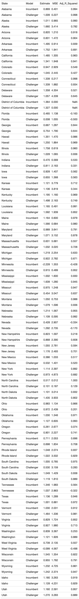

# Using Polls to Predict Elections

### Introduction

Switching gears from last week's blog post on the [economy](Econ.md), this week's
blog post focuses on the predictive power of polls. First, I will show and evaluate a model
that focuses on nation-level polls. Then, I will compare that model to models built
on a state-by-state basis. Finally, I will use these models to predict the 2020 election

### Model 1: National Level Polls

Although I call this section model 1, it really discusses two models: one for incumbent vote share
and one for challenger vote share. Ultimately, I will combine the results of the two models in my prediction.
In the case of 2020, the incumbent model will be used to predict Trump's popular vote share and the 
challenger model will be used to predict Biden's popular vote share. For each model, I ran a linear regression of
popular vote share vs. average poll support. 

The independent variable, average poll support,
was calculated by taking the average result from each poll six weeks out from the election
in every year (i.e. the average support in 2008 would be equal to the average result of every poll from 2008
taken about six weeks out from the election in the data set). I only include polls taken six weeks
out from the election because, as of today (9/23/2020), we are about six weeks away from the 2020
election. Moreover, polls become [increasingly better predictors](https://www.semanticscholar.org/paper/Election-forecasting%3A-Too-far-out-Jennings-Lewis-Beck/7d0621cd3f984483652caf09e7764c88233948d7) of the election as they get
closer to the election, so it makes sense to focus on the most recent data we have available (as of today, that is polls
about six weeks away from the election). The results of the two regressions (incumbent and challenger) are 
shown below. 

#### Model Analysis: summary and in sample fit

The regression results for both the incumbent and challenger models are shown below.

###### Analysis
<- The Adjusted R Squared is better for the incumbent model but still decent for the challenger model
<- Both models have fairly low Mean Squared Errors
<- Overall, the in sample fit for both of these models is promising

#### Model Analysis: out sample fit
In order to avoid overfitting the model to historical data, I ran
leave-one-out cross validation to evaluate the model's out-of-sample performance.
The cross validation process includes taking one election year out of the data,
building a model without that year's data, and then using the model to predict
the left out election. The prediction is considered "correct" if the model
correctly predicts the winning party in the election (the winning party
is whichever party (incumbent or challenger) has the higher popular vote). 

The national polls model has a classification accurracy of **0.900**, meaning
that the model correctly predicted 90% of elections in the cross validation
process. 

### Model 2: State Level Polls

The national poll model appears to be a good predictive model based off of its in-sample
and out-sample statistics. However, the American presidentiial election is not decided 
by the national popular vote, but rather the electoral college. Thus, it could be more
informative to predict the election on a state-by-state basis. In order to build this 
state model, I ran linear regressions for each individual state using historical polling
data from that state. As with the national model, I calculated both an incumbent and challenger
model for every state. 

The independent variable for each regression is calculated by taking 
the mean of every poll taken six weeks out from the election in each state for a given 
election year. However, unlike national-level polls, there is not data available for 
every election year for every state. This lack of data has some important implications.
First, for almost every state, there are fewer data points to run a regression on compared
to the national model. Second, in order to ensure there is data on at least three election
years for every state, I had to include the results of polls taken seven weeks away
from the election when calculating the average support variable (this was the case for 
Idaho, Delaware, Alaska, Utah, DC, Georgia, Mississippi, South Dakota, Wyoming,
Hawaii, Kentucky, and North Dakota). For Idaho, Wyoming, and DC, I had to include
polls taken eight weeks away from the election. This is significant because, as
discussed above, polls become less predictive the farther away they get from the 
election. 

# A collapsible section with markdown

  
Click to see regression results!

  

are at least three election years

Whether or not you still trust polls after
the [2016 election](https://www.pewresearch.org/fact-tank/2016/11/09/why-2016-election-polls-missed-their-mark/),
there is no denying 
