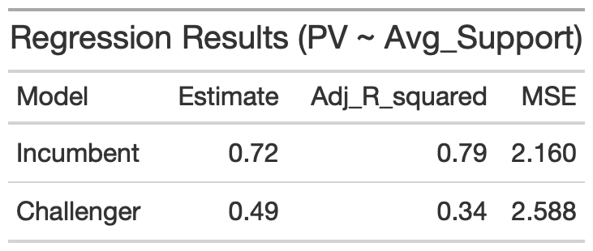

# Using Polls to Predict Elections

### Introduction

Switching gears from last week's blog post on the [economy](Econ.md), this week's
blog post focuses on the predictive power of polls. First, I will show and evaluate a model
that focuses on nation-level polls. Then, I will compare that model to models built
on a state-by-state basis. Finally, I will use these models to predict the 2020 election

### Model 1: National Level Polls

Although I call this section model 1, it really discusses two models: one for incumbent vote share
and one for challenger vote share. Ultimately, I will combine the results of the two models in my prediction.
In the case of 2020, the incumbent model will be used to predict Trump's popular vote share and the 
challenger model will be used to predict Biden's popular vote share. For each model, I ran a linear regression of
popular vote share vs. average poll support. 

The independent variable, average poll support,
was calculated by taking the average result from each poll six weeks out from the election
in every year (i.e. the average support in 2008 would be equal to the average result of every poll from 2008
taken about six weeks out from the election in the data set). I only include polls taken six weeks
out from the election because, as of today (9/23/2020), we are about six weeks away from the 2020
election. Moreover, polls become [increasingly better predictors](https://www.semanticscholar.org/paper/Election-forecasting%3A-Too-far-out-Jennings-Lewis-Beck/7d0621cd3f984483652caf09e7764c88233948d7) of the election as they get
closer to the election, so it makes sense to focus on the most recent data we have available (as of today, that is polls
about six weeks away from the election). The results of the two regressions (incumbent and challenger) are 
shown below. 


#### Model Analysis: summary and in sample fit

The regression results for both the incumbent and challenger models are shown below.

###### Analysis
<- The Adjusted R Squared is better for the incumbent model but still decent for the challenger model
<- Both models have fairly low Mean Squared Errors
<- Overall, the in sample fit for both of these models is promising

#### Model Analysis: out sample fit
In order to avoid overfitting the model to historical data, I ran
leave-one-out cross validation to evaluate the model's out-of-sample performance.
The cross validation process includes taking one election year out of the data,
building a model without that year's data, and then using the model to predict
the left out election. The prediction is considered "correct" if the model
correctly predicts the winning party in the election (the winning party
is whichever party (incumbent or challenger) has the higher popular vote). 

The national polls model has a classification accurracy of **0.900**, meaning
that the model correctly predicted 90% of elections in the cross validation
process. 

### Model 2: State Level Polls

The national poll model appears to be a good predictive model based off of its in-sample
and out-sample statistics. However, the American presidentiial election is not decided 
by the national popular vote, but rather the electoral college. Thus, it could be more
informative to predict the election on a state-by-state basis. In order to build this 
state model, I ran linear regressions for each individual state using historical polling
data from that state. As with the national model, I calculated both an incumbent and challenger
model for every state. 

The independent variable for each regression is calculated by taking 
the mean of every poll taken six weeks out from the election in each state for a given 
election year. However, unlike national-level polls, there is not data available for 
every election year for every state. This lack of data has some important implications.
First, for almost every state, there are fewer data points to run a regression on compared
to the national model. Second, in order to ensure there is data on at least three election
years for every state, I had to include the results of polls taken seven weeks away
from the election when calculating the average support variable (this was the case for 
Idaho, Delaware, Alaska, Utah, DC, Georgia, Mississippi, South Dakota, Wyoming,
Hawaii, Kentucky, and North Dakota). For Idaho, Wyoming, and DC, I had to include
polls taken eight weeks away from the election. This is significant because, as
discussed above, polls become less predictive the farther away they get from the 
election. 

```
Alabama	Incumbent	0.868817690	0.4013510	0.99410757
2	Alabama	Challenger	1.009252677	0.2273392	0.99780518
3	Alaska	Incumbent	1.010847099	0.9650642	0.99014385
4	Alaska	Challenger	1.659872801	3.4139921	0.78180180
5	Arizona	Incumbent	0.819773074	1.2104677	0.91835377
6	Arizona	Challenger	0.831007138	1.4719556	0.90368285
7	Arkansas	Incumbent	1.495028621	0.9143144	0.93911791
8	Arkansas	Challenger	1.752036073	1.9406431	0.69086548
9	California	Incumbent	1.484624706	1.3052389	0.96281092
10	California	Challenger	1.340550080	1.9480117	0.94125625
11	Colorado	Incumbent	0.946637661	2.9287580	0.54888532
12	Colorado	Challenger	1.044534854	2.4449532	0.42746555
13	Connecticut	Incumbent	1.339229382	0.2169901	0.99836226
14	Connecticut	Challenger	1.339184426	1.8823875	0.93395955
15	Delaware	Incumbent	1.357782475	4.3038115	0.52064060
16	Delaware	Challenger	1.057446434	4.3386194	0.64494481
17	District of Columbia	Incumbent	1.364277394	0.0000000	NaN
18	District of Columbia	Challenger	1.326563453	0.0000000	NaN
19	Florida	Incumbent	0.465317176	1.1377635	-0.16266654
20	Florida	Challenger	0.007523679	1.0054100	-0.49990715
21	Georgia	Incumbent	0.666643947	1.2869696	0.84431874
22	Georgia	Challenger	0.753920275	1.7900855	0.64418282
23	Hawaii	Incumbent	1.351174030	1.4701692	0.98617324
24	Hawaii	Challenger	1.250311933	1.8640632	0.96906968
25	Illinois	Incumbent	1.758020312	0.6186956	0.95967086
26	Illinois	Challenger	1.027548143	1.0645738	0.93570445
27	Indiana	Incumbent	0.470067303	0.5694351	0.53293773
28	Indiana	Challenger	0.811006762	2.1627258	0.33063975
29	Iowa	Incumbent	0.927545300	1.4068921	0.56226793
30	Iowa	Challenger	0.654999028	1.3680497	0.56316101
31	Kansas	Incumbent	1.120930036	3.7787892	0.71160723
32	Kansas	Challenger	1.106157348	3.8189793	0.34440259
33	Kentucky	Incumbent	1.194976326	1.1600975	0.96855352
34	Kentucky	Challenger	1.498307535	2.1631899	0.74943106
35	Louisiana	Incumbent	1.164587590	0.4907150	0.99140505
36	Louisiana	Challenger	1.592388619	1.9387516	0.85153412
37	Maine	Incumbent	1.164487485	0.5996865	0.97925314
38	Maine	Challenger	1.566300963	0.6844030	0.98007926
39	Maryland	Incumbent	0.989383127	3.6412757	0.79131820
40	Maryland	Challenger	1.071481815	3.1517915	0.87796792
41	Massachusetts	Incumbent	0.630897247	5.6813705	0.55722844
42	Massachusetts	Challenger	1.032317811	3.0201562	0.72813897
43	Michigan	Incumbent	1.218935683	2.2538062	0.63283776
44	Michigan	Challenger	0.922339631	2.7821159	0.67074851
45	Minnesota	Incumbent	-2.228055108	1.3533635	-0.42757020
46	Minnesota	Challenger	0.914969130	0.4890269	0.95223841
47	Mississippi	Incumbent	1.001855213	1.6002733	0.93038338
48	Mississippi	Challenger	1.639434424	1.2795115	0.94487934
49	Missouri	Incumbent	0.975306121	1.2478638	0.94688744
50	Missouri	Challenger	0.453944751	3.0471590	0.63743770
51	Montana	Incumbent	1.050288155	0.7531834	0.98773788
52	Montana	Challenger	1.079309711	1.5963928	0.93554767
53	Nebraska	Incumbent	1.213611960	1.5671768	0.95543498
54	Nebraska	Challenger	1.108836883	0.5950677	0.99236624
55	Nevada	Incumbent	0.427854553	2.9070645	-0.33401865
56	Nevada	Challenger	1.291593795	2.7349683	-0.17025246
57	New Hampshire	Incumbent	0.822701064	1.5972259	0.21781776
58	New Hampshire	Challenger	0.868311703	2.3897046	0.60847111
59	New Jersey	Incumbent	1.055369399	2.7811625	0.59427955
60	New Jersey	Challenger	1.175677242	2.4930834	0.70089264
61	New Mexico	Incumbent	0.386397536	1.0334465	0.51714565
62	New Mexico	Challenger	0.532389211	1.4010894	0.51982680
63	New York	Incumbent	1.113815796	2.3969488	0.89235589
64	New York	Challenger	0.973294411	4.8732279	0.68227534
65	North Carolina	Incumbent	0.516770770	0.0121149	0.99980592
66	North Carolina	Challenger	0.101381211	0.1865751	0.12904902
67	North Dakota	Incumbent	1.101486574	3.0139117	0.93150339
68	North Dakota	Challenger	1.434735064	3.9325022	0.80152515
69	Ohio	Incumbent	0.983308652	1.1341470	0.86584364
70	Ohio	Challenger	0.971946870	2.4393139	0.20114386
71	Oklahoma	Incumbent	1.029746085	1.3463542	0.97071932
72	Oklahoma	Challenger	1.127430330	0.6048525	0.99311450
73	Oregon	Incumbent	0.260865379	2.6767339	0.07353247
74	Oregon	Challenger	0.900759598	2.2268911	0.74088708
75	Pennsylvania	Incumbent	0.710577860	2.0533045	0.69598550
76	Pennsylvania	Challenger	0.697583179	1.8335518	0.70769095
77	Rhode Island	Incumbent	1.047617238	2.0737977	0.93718318
78	Rhode Island	Challenger	1.022271321	3.5015940	0.82912237
79	South Carolina	Incumbent	1.004664288	0.7851473	0.97458011
80	South Carolina	Challenger	0.530227363	3.1594522	0.28265029
81	South Dakota	Incumbent	1.049457849	1.4287887	0.93809920
82	South Dakota	Challenger	1.118543379	1.8101301	0.88922855
83	Tennessee	Incumbent	1.346256305	1.9833158	0.56417565
84	Tennessee	Challenger	1.037468357	2.8626054	-0.32194034
85	Texas	Incumbent	1.136454217	1.2886801	0.94576063
86	Texas	Challenger	1.001431279	0.8807636	0.97218100
87	Vermont	Incumbent	1.030459998	2.0307450	0.91228484
88	Vermont	Challenger	1.464193354	1.3361267	0.98123879
89	Virginia	Incumbent	0.829286381	1.7243475	0.85184179
90	Virginia	Challenger	0.926770930	1.9796796	0.71281805
91	Washington	Incumbent	0.839383467	3.3669439	0.25333521
92	Washington	Challenger	1.121339323	1.9258574	0.88933846
93	West Virginia	Incumbent	0.739154797	2.1347717	0.55712669
94	West Virginia	Challenger	-0.099264613	4.5669198	-0.49839926
95	Wisconsin	Incumbent	1.545188350	1.3537522	0.82170901
96	Wisconsin	Challenger	0.954602386	1.7823557	0.79079490
97	Wyoming	Incumbent	1.232444415	4.7247768	0.86149009
98	Wyoming	Challenger	1.241515129	2.3741643	0.94748686
99	Idaho	Incumbent	1.179794504	3.2630818	0.91929354
100	Idaho	Challenger	1.128187076	4.2311671	0.82872291
101	Utah	Incumbent	1.159518007	2.5914826	0.95686115
102	Utah	Challenger	1.270213176	3.2830468	0.88905973
```


are at least three election years


Whether or not you still trust polls after
the [2016 election](https://www.pewresearch.org/fact-tank/2016/11/09/why-2016-election-polls-missed-their-mark/),
there is no denying 
