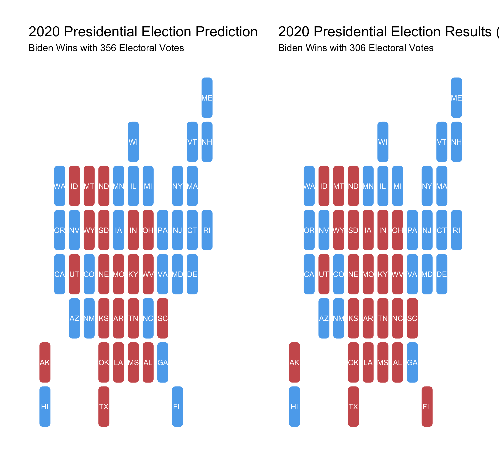
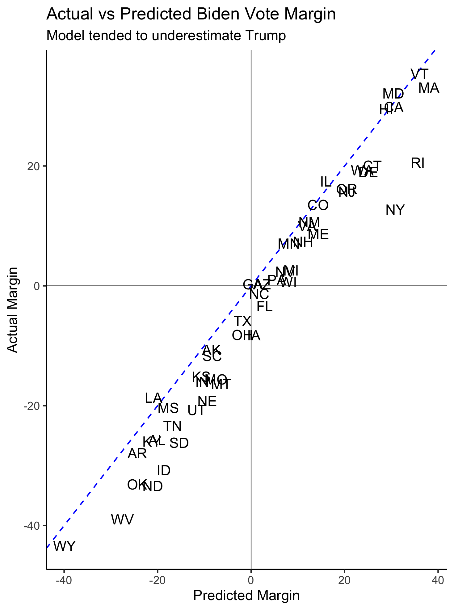
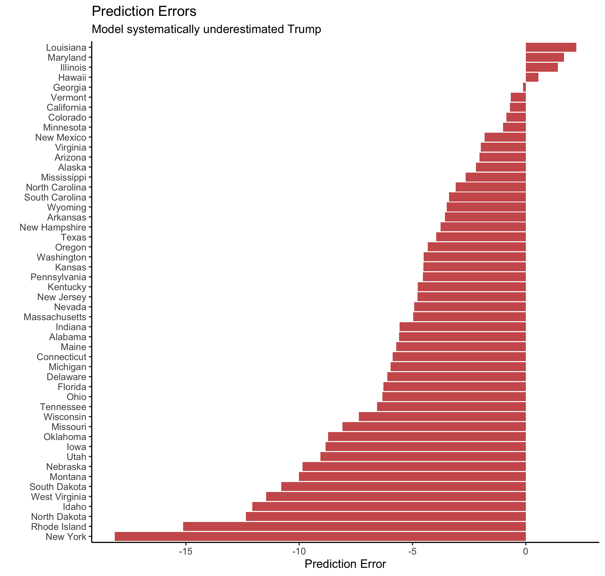
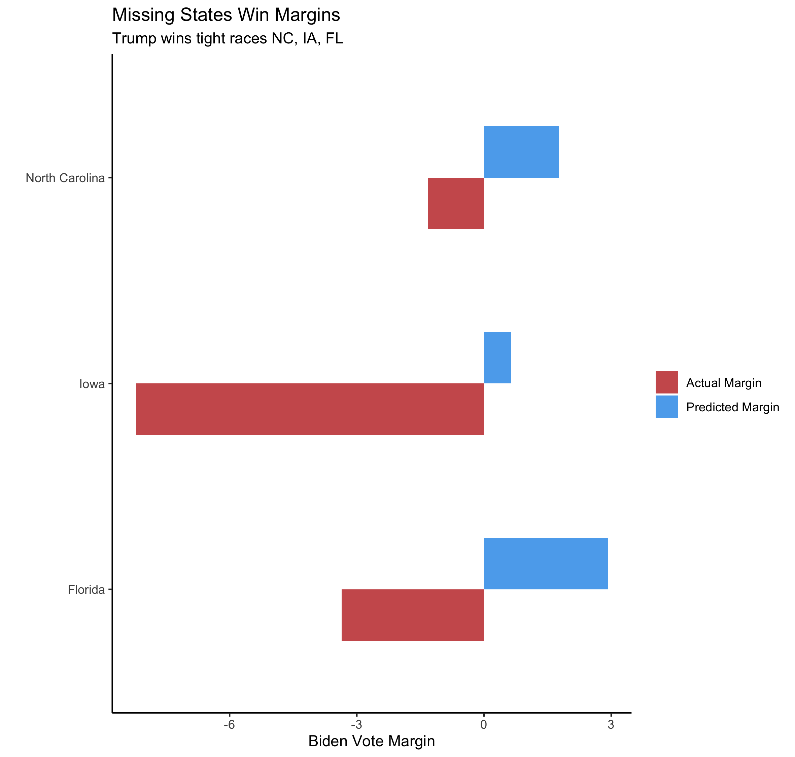
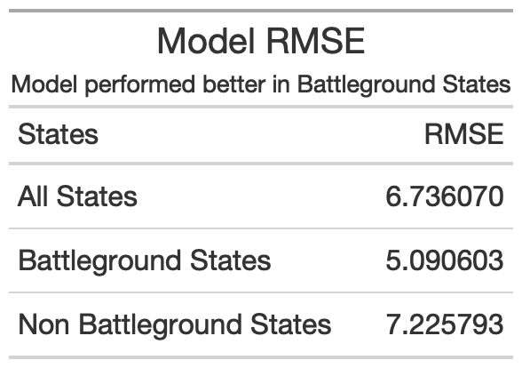

# Post Election Model Reflection

November 23, 2020
Lindsey Greenhill

#### Introduction

Joe Biden won the 2020 election with 306 electoral votes. Donald Trump lost with 232. This blog post will look at how well my model predicted these results. Spoiler alert: it left something to be desired. To get a detailed summary of my model, look at my [Final Prediction](final_prediction.md) blog post. As a quick refresher, my model is an ensemble of pooled and indosyncratic models that incorporate both polling and demographic data. 

### What happened on a state by state basis?

My model predicted that Biden would win with 356 electoral votes. So, where was I wrong? The map belows shows a comparison of my final predictions with what actually happened. 

##### Discussion

> - My model incorrectly predicted 3 states (Florida, North Carolina, and Iowa)
> - All of these states went to Trump
> - These states' 50 electoral votes (FL 29, NC 15, IA 6) make up the difference between the actual electoral vote count and my predicted vote count 
> - These results translate into my model being abouot 94% accurate

*Note:* My model did not account for the different electoral vote districts in Nebraska and Maine, which both ended up voting for the opposite party from the rest of the state. Maine's electoral district voted Republican and Nebraska's voted Democrat. If I could redo my model, I would account for these districts. 

### A closer look

My model correctly predicted 48 out of 51 states (including DC), but how close were my point predictions to the actual vote share? The graphic below shows the actual Biden vote margins vs. my predicted Biden vote margins. If a state is on the dotted blue line, then my predicted vote margin lines up exactly with the actual vote margin.  If a state is below the dotted blue line, then the actual Biden vote margin was less than I predicted it to be. For example, in Idaho, I predicted Biden's vote margin to be -18.7%, but the actual Biden vote margin was -30.7%.

##### Discussion

> - In general, I tended to overestimate Biden and underestimate Trump
> - In states where I predicted Trump would win (those in the bottom left quadrant) and he did, I for the most part underestimated Trump's win margin
> - In states where I predicted Biden would win (those in the top right quadrant) and he did, I for the most part overestimated Biden's win margin
> - The states that I predicted Biden would win but didn't are in the bottom right quadrant (Florida, North Carolina, and Iowa)
> - I didn't predict that Trump would win any states that he did not

The graphic below visualizes these errors in another way. 

##### Discussion

> - My model performed the worst in New York, where I predicted Biden would win with a 30.8% margin. As of the last time I checked, Biden only won by 12.7 points. However, not all of the votes had been counted so that margin could change
> - The only states I overestimated Biden's vote margin in are Louisiana, Maryland, and Illinois
> - My model was very accurate in Illinois, Hawaii, Geogia, Vermont, California, and Colorado. 
> - As I discussed above, the takeaway from these errors is that I underestimated Trump in most states

### Looking at the states I missed

My model incorrectly predicted that Biden would win Iowa, North Carolina, and Florida. If you look at the first error chart above, you can see how large my error in each state is. The graphic below shows the error in these states in more detail. 

##### Discussion

> - My model's smallest error amonst these three states was for North Carolina (-3 points)
> - My model greatly underestimated Trump's performance in Iowa (-8.8 points)
> - My model had a -6.3 error in Florida

### Some statistics

Overall given the data above, my model had a RMSE of **6.7**. It performed slightly better in battleground states (AZ, GE, OH, FL, NH, NV, MI, PA, MN, WI, NC, IA, TX) than non battleground states. 

### Where did it go wrong?

There are a few places where my model could've gone wrong. For one, my model relied heavily on **polling data**, and, as with 2016, the polls for 2020 were not particularly accurate. Secondly, my model also relied on demographic data, and I believe that some demographic groups could have behaved in a non predictable way. 

#### What went wrong in the polls?

There are a few theories as to what was wrong with the polls. I've summarised a few of them below.

 > - First, some think that Covid-19/quarantine exaggerated response bias as Democrats answered polls at higher rates. This led to an overrepresentation of Democrats in many polls. 
 > - At the same time, Republican voters answered polls at lower rates (according to the NYT, due in part to a general distrust of institutions and the media).
 > - The record turnout rate this year also made it more difficult for pollsters to predict what the electorate would be like (which affects how they weight the poll results).
 > - The shy Trump theory is still plausible (people won't expose themselves as a Trump supporter), but likely not the main culprit in 2020.
 
 *Note:* Summarised from [NPR](https://www.npr.org/2020/11/19/936317341/why-were-the-polls-off-pollsters-have-some-early-theories) and [NYT](https://www.nytimes.com/2020/11/12/us/politics/election-polls-trump-biden.html)
 
#### And the demographics?

There are two demographic groups that did not vote the way they were supposed to in key areas. First and very publicized, Hispanics in [Miami Dade county](https://www.nytimes.com/2020/11/21/us/miami-hispanic-voters.html) did not support Biden as fervently as many believed they would. As a reminder, my model predicts that an increase in the Hispanic population is correlated with an increase in the Democrat vote share. However, the Hispanic population in Miami Dade county (heavily comprised of Cubans) voted more Republican than they had historically. Many believe that this support for Trump is why Biden lost Florida. Second, Trump actually won more of the black vote than other Republican candidates in [recent elections](https://www.theguardian.com/commentisfree/2020/nov/14/joe-biden-trump-black-latino-republicans). My model predicts that on average an increase in Black voters corresponds with an increase in the Democrat vote share. If Black voters did in fact vote more for Trump than predicted, that would throw off my results in favor of Biden.

### How could I test these theories?

There are a few different quantitative tests one could run to test the above hypotheses. 

> - To test how the polls were affected by Corona, you could gather data to test if the response bias meaningfully influenced the polls, but gathering this data retrospectively could be difficult.
> - Testing the shy Trump theory could also be difficult. If one assumes that social pressure is large reason why a voter might not want to admit their intentions to vote for Trump, you could compare polling results in areas that largely favor Biden vs. areas that largely favor Trump, as some have [already done](https://www.pewresearch.org/fact-tank/2020/11/13/understanding-how-2020s-election-polls-performed-and-what-it-might-mean-for-other-kinds-of-survey-work/).
 
 

