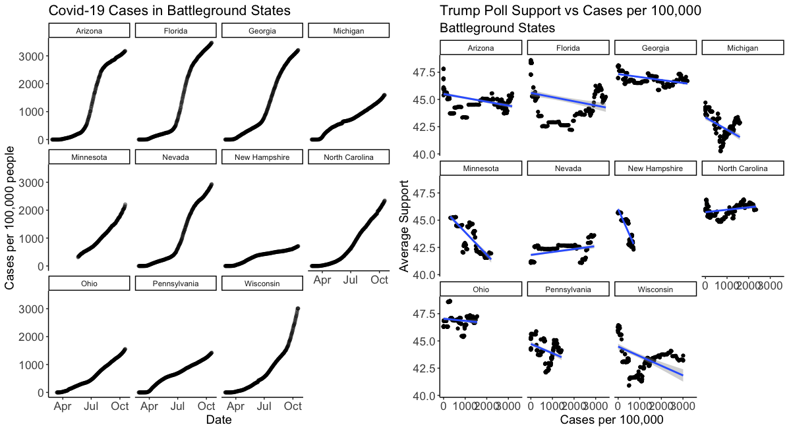

# Covid-19, Blame, and Trump Support

October 24, 2020

## Introduction

Covid-19 is obviously at the forfront of many voters minds today. As proven in the final presidential [debate](https://www.wsj.com/articles/final-trump-biden-debate-marks-start-of-sprint-to-election-11603386976), a lot of ambiguity still surrounds the question of different vaccines and the potential end of the pandemic. Also discussed in the debate was President Trump's success or failure with handling the virus, depending on your perspective. This question of "did Trump do a good job with Covid?" draws attention to a larger point of interest: do voters blame Trump for the continued pandemic? 

In this blog post I will investigate this question through looking at the relationship of average poll support for Trump and different measures of Covid-19 progression such as death rate and cases per capita. 

## Background: how did Covid-19 affect different states? 

For some brief context of the historical and current state of Covid-19 in each state, see the visual below that shows Covid-19 cases per 100,000 people in each state. 

> - It is apparent that cases per capita is continuing to grow as we near the election
> - Southern states seem to be hit relatively hard on a per capita basis 
> - Battleground states such as Arizona, Georgia, and Florida seem to have some of the highest case rates for their populations

## Is there a relationship between polls and worsening of Covid-19?

If voters do blame Trump for the pandemic, it's possible that it would be reflected in the polls. I would expect that if this were the case, a worsening of Covid-19 conditions would lead to a decrease in support for Trump. The graffic below shows the relationship between shifts in polls and cases per 100,000 across states. As you can see, there doesn't appear to be a relationship between the two variables, and running a regression shows no statistically significant relationship betwen the two variables as well. 

#### Discussion

> - This figure suggests that voters do not punish Trump simply because of an increase in Covid-19 cases
> - It makes sense that the pandemic would not shift the polls in strongly blue or strongly red states, so this could be masking the relationship of poll changes in battleground states
> - However, running a regression that accounts for battleground status does not reveal for any statistically significant relationships either

## Covid in Battleground States

It is interesting to look at analysis of Covid-19 metrics and poll support for Trump in individual battleground states. 

### Cases per Capita

First, we will look at the same metric as above, cases per 100,000 in each battleground state. The graphics below show the evolution of that metric in each state as well as the relationship between Trump Support in each state and that number. 

#### Discussion
> - It is evident that the rate at which Covid-19 is growing hasn't slowed in some states
> - In some states there is a positive correlation between cases and Trump support
> - In some states there is a negative correlaiton between cases and Trump support
> - There doesn't appear to be a strong linear relationship across states and even in individual states
> - This implies that voters have not directly punished Trump for growth in cases
> - Thus, it would be difficult to estimate how Covid-19 will effect the election from this metric

### Death Rate

Death rate is another way to look at how damaging Covid-19 is in a certain state. Perhaps it is the case that voters will respond more to death than just illness and that relationship will be reflected in the polls. The graphic below shows the change in death rate over time in battleground states as well as the relationship between poll support for Trump and death rate. 

#### Discussion

> - There does not seem to be a consistent linear relationship between death rate and poll support for Trump
> - As with looking at cases per capita, some states show a negative correlation and other states show a positive correlation
> - This inconsistency makes it difficult to predict how Covid-19 will affect the election across states or even within states

